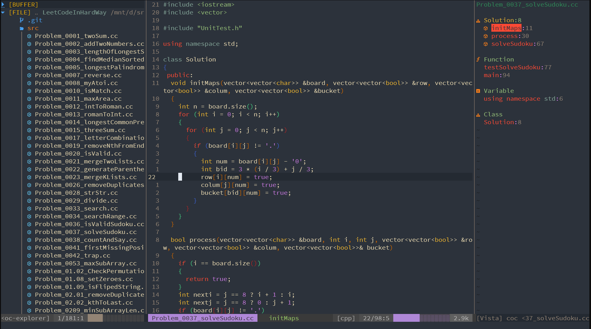

# The Elegant Neovim Configuation

<center></center>

## 📰 Brief

Clean and modularized neovim config files.

## Requirements

- NeoVim 0.6.0+

### 🔧 Tools

- Install `nodejs` for coc extension
- Install `ctag` for function/class/variable list
- Install `figlet` for inputing text ASCII art
- Install [`win32yank`](https://github.com/equalsraf/win32yank) for WSL
  - Download it on Windows and add it to PATH of Windows.

## 🗺️ Keyboard Shortcuts

### Basic Mappings

| Shortcut | Effect            |
|----------|-------------------|
| `<C-q>`  | Quit              |
| `<A-q>`  | Auit all windows  |
| `C-s`    | save current file |

### Additional Cursor Movement

| Shortcut   | Effect                                                    |
|------------|-----------------------------------------------------------|
| `H`        | Cursor to the start of the line                           |
| `L`        | Cursor to the end of the line                             |
| `Ctrl` `k` | Move the view port up 5 lines without moving the cursor   |
| `Ctrl` `j` | Move the view port down 5 lines without moving the cursor |
| `h`        | Move to the end of this word                              |
| `W`        | Move cursor five words forward                            |
| `B`        | Move cursor five words forward                            |

## 🗺️ Window Management

### Create Window Through Split Screen

| Shortcut    | Effect                                                                      |
|-------------|-----------------------------------------------------------------------------|
| `s` `k`     | Create a new horizontal split screen and place it above the current window  |
| `s` `j`     | Create a new horizontal split screen and place it below the current window  |
| `s` `l`     | Create a new vertical split screen and place it left to the current window  |
| `s` `h`     | Create a new vertical split screen and place it right to the current window |
| `c` `v`     | Set the two splits to be vertical                                           |
| `c` `h`     | Set the two splits to be horizontal                                         |
| `c` `r` `v` | Rotate splits and arrange splits vertically                                 |
| `c` `r` `h` | Rotate splits and arrange splits horizontally                               |

### Moving the Cursor Between Different Windows

| Shortcut      | Effect                         |
|---------------|--------------------------------|
| `SPACE` + `w` | Move cursor to the next window |
| `SPACE` + `l` | Move cursor one window left    |
| `SPACE` + `h` | Move cursor one window right   |
| `SPACE` + `k` | Move cursor one window up      |
| `SPACE` + `j` | Move cursor one window down    |

### Resizing Different Windows

| Shortcut  | Effect             |
|-----------|--------------------|
| `Alt` `h` | Vertical resize -3 |
| `Alt` `j` | Resize +3          |
| `Alt` `k` | Resize -3          |
| `Alt` `l` | Vertical resize -3 |

## 🗺️ Tab Management

| Shortcut    | Effect           |
|-------------|------------------|
| `t` `b`     | Create a new tab |
| `t` `h`     | Go one tab left  |
| `t` `l`     | Go one tab right |
| `t` `m` `h` | Move tab left    |
| `t` `m` `l` | Move tab right   |

## 🔌 Plugins Keybindings

### AutoCompletion

#### [coc](https://github.com/neoclide/coc.nvim)

| Shortcut        | Effect                              |
|-----------------|-------------------------------------|
| `gD`            | Go to definition                    |
| `gh`            | List references                     |
| `K`             | Show documentation                  |
| `SPACE` `r` `n` | Rename a variable                   |
| `SPACE` `c` `f` | Format selected                     |
| `Shift` `Tab`   | Previous Cursor position in snippet |
| `Tab`           | Next Cursor position in snippet     |
| `t` `s`         | Translate word under cursor         |

### Text Editing Plugins

#### [vim-table-mode](https://github.com/dhruvasagar/vim-table-mode)

| Shortcut        | Effect            |
|-----------------|-------------------|
| `SPACE` `t` `m` | Toggle table mode |

#### [undotree](https://github.com/mbbill/undotree)

| Shortcut      | Effect        |
|---------------|---------------|
| `SPACE` + `u` | Open Undotree |
| `j`           | Newer Version |
| `k`           | Older Version |

#### [vim-markdown-toc](https://github.com/mzlogin/vim-markdown-toc)

In `markdown` files, type `:Gen` then tab, you'll see your options.

### Find and Replace

#### [nvim-spectre](https://github.com/nvim-pack/nvim-spectre)

| Shortcut      | Effect            |
|---------------|-------------------|
| `SPACE` + `f` | Search or replace |

### Git Related

#### [vim-gitgutter](https://github.com/airblade/vim-gitgutter)

| Shortcut        | Effect                            |
|-----------------|-----------------------------------|
| `SPACE` `g` `p` | **Show git hunk at current line** |
| `SPACE` `g` `k` | Go to previous git hunk           |
| `SPACE` `g` `j` | Go to next git hunk               |
| `SPACE` `g` `f` | Fold everything except hunks      |

### Others

#### [goyo](https://github.com/junegunn/goyo.vim)

| Shortcut | Effect      |
|----------|-------------|
| `g` `y`  | toggle Goyo |

#### [figlet](https://github.com/cmatsuoka/figlet)

Press `t` `x` and enter your text.

`tx Hello<Enter>`

```txt
 _   _      _ _
| | | | ___| | | ___
| |_| |/ _ \ | |/ _ \
|  _  |  __/ | | (_) |
|_| |_|\___|_|_|\___/
```

### Custom Snippets

#### Markdown

| Shortcut     | What it creates     |
|--------------|---------------------|
| `,n`         | ---                 |
| `,b`         | **Bold** text       |
| `,s`         | ~~sliced~~ text     |
| `,i`         | *italic* text       |
| `,d`         | `code block`        |
| `,c`         | big `block of code` |
| `,m`         | - [ ] check mark    |
| `,p`         | picture             |
| `,k`         | [link]()            |
| `,1`         | # H1                |
| `,2`         | ## H2               |
| `,3`         | ### H3              |
| `,4`         | #### H4             |
| `,5`         | ##### H5            |
| `,6`         | ###### H6           |
| `SPACE` `m1` | Turn to # H1        |
| `SPACE` `m2` | Turn to ## H2       |
| `SPACE` `m3` | Turn to ### H3      |
| `SPACE` `m4` | Turn to #### H4     |
| `SPACE` `m5` | Turn to ##### H6    |
| `SPACE` `m5` | Turn to ###### H6   |
| `,l`         | --------            |
| `,t`         | current time        |

`,f` to go to the next `<++>` (placeholder).

`,w` to go to the next `<++>` (placeholder) and then press `Enter` for you.

## ❤️ Thanks to

- [chemzqm/vimrc](https://github.com/chemzqm/vimrc)
- [skywind3000/vim](https://github.com/skywind3000/vim)
- [theniceboy/nvim](https://github.com/theniceboy/nvim)
